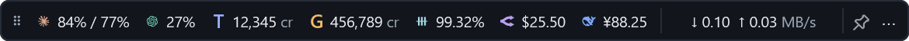
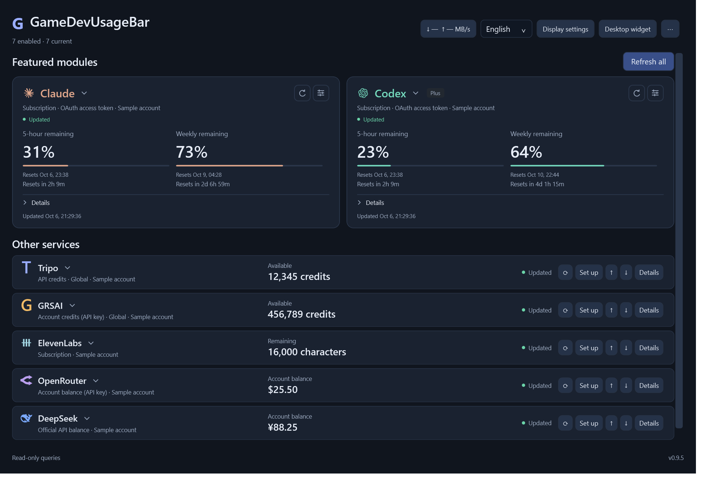
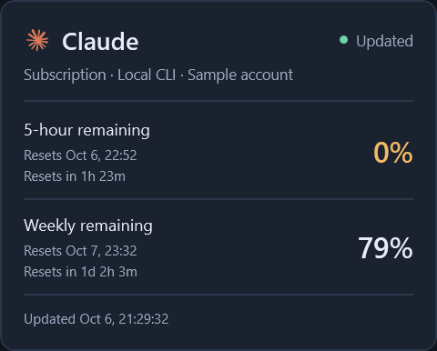
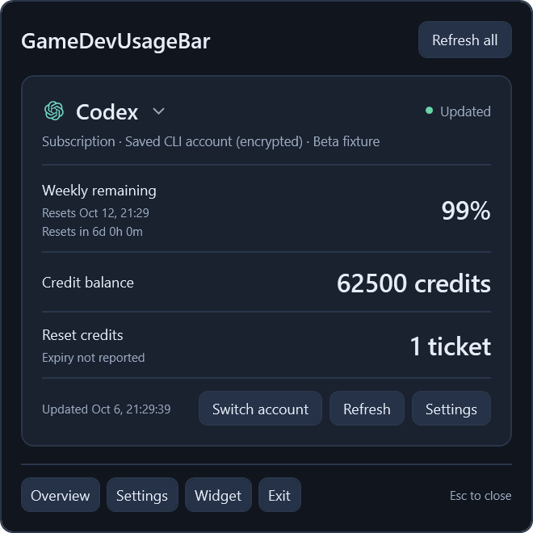
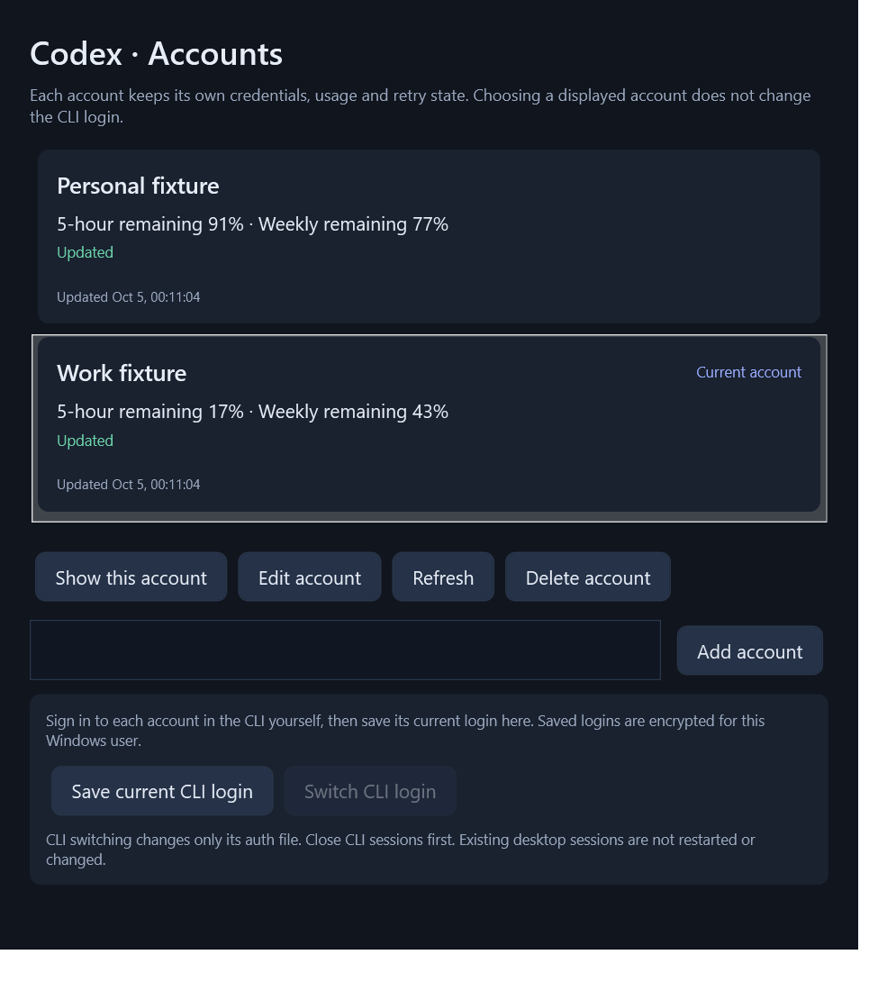

<div align="center">

# GameDevUsageBar

**Your AI quotas, credits, and balances. One quiet Windows bar.**

Windows 10/11 · x64 · English / 简体中文 · v0.9.5 preview

[Download](https://github.com/tabztggg/GameDevUsageBar/releases/tag/v0.9.5) · [Installation](docs/installation.md) · [中文](README.zh-CN.md) · [Quota API](QUOTA-API.md) · [Release notes](docs/releases/v0.9.5.md)

</div>



Keep Claude and Codex quota windows, Tripo and GRSAI credits, API balances, and local network speed within reach. Use the notification-area icon, a single-row floating bar, or the full overview.

*Screenshots show actual WPF views rendered with synthetic test data. They contain no real user accounts and do not prove live vendor access.*

## Get started

Download the Windows x64 package from [Releases](https://github.com/tabztggg/GameDevUsageBar/releases/tag/v0.9.5):

| Package | Best for |
| --- | --- |
| `GameDevUsageBar-0.9.5-win-x64-setup.exe` | A fixed installation with Start menu shortcuts and optional logon startup |
| `GameDevUsageBar-0.9.5-win-x64.zip` | Extracting and running without an installer |
| `SHA256SUMS.txt` | Checking download integrity |

The runtime is included. **No .NET, Node.js, Git, or developer tools are required to run the app.** Keep the complete portable folder together.

Open GameDevUsageBar, choose a service's **Settings**, configure its credential source, enable it, and save. New sources are disabled until configured. See [installation](docs/installation.md) for startup, upgrades, removal, and troubleshooting.

## A compact bar, a useful overview



- **One desktop row.** A 36-DIP strip with small icons, remaining percentages, native credit/currency units, and download/upload speed in decimal MB/s.
- **Two featured modules you choose.** Put any supported service in either large overview module; keep the others in compact, expandable rows.
- **Clear reset details.** Five-hour windows show hours and minutes; longer windows show days, hours, and minutes. Reported reset tickets show count and expiry in one row.
- **Matching hover and click details.** Both expose quota windows, reset dates/countdowns, and status; click panels add actions.
- **Position and transparency controls.** Drag the grip, pin the bar above other windows, lock its position, or adjust background transparency without fading the text.
- **English and Simplified Chinese.** Switch immediately; custom account labels remain unchanged.

Percentages mean **remaining quota**, not consumed usage. Missing fields stay unknown. Live, cached, stale, demo, authentication, permission, and rate-limit states remain distinct.

### Hover for details, click for actions

Hover shows the quota windows, reset countdowns, and freshness. Click opens the same information with account switching, Refresh, and Settings actions.

| Hover card | Clicked provider popup |
| --- | --- |
|  |  |

## Supported services

| Service | Measurement | Connection |
| --- | --- | --- |
| Claude | Reported five-hour, weekly/model quotas and extra-use information | Current CLI OAuth, saved CLI login, manual OAuth, or Firefox Cookie + organization UUID |
| Codex | Reported quota windows, plan, credits, and reset-ticket inventory/expiry | Current CLI login, saved CLI login, or manual subscription OAuth |
| Tripo | Available/frozen **API** credits; Global and China endpoints | API key |
| GRSAI | Account credit balance; Global and China nodes | API key |
| DeepSeek | Official API balances, preserving returned currencies | API key |
| ElevenLabs | Character allowance, used/remaining characters, and reset time | API key |
| OpenRouter | Account remaining USD: purchased credits minus usage | API key with access to the credits endpoint |
| Gemini CLI | Code Assist quota buckets and reset times | Current CLI login or manual OAuth |
| Gemini AI Studio | Completed project Gemini API requests over 24 hours | Google Cloud project + OAuth with Monitoring read permission |

Adapters are implemented; your vendor account must allow access to its endpoint. Claude/Codex plan labels do not imply fixed allowances: the app displays the windows returned. Optional ticket inventory is displayed only when supplied; live Claude ticket retrieval is not guaranteed.

Tripo API credits exclude Studio credits. Gemini AI Studio request counts are **not remaining quota or balance** and cannot be read with a Gemini API key. OpenRouter may require a management key for its credits endpoint. TypeSafe and VPS traffic monitoring are not included.

## Multiple accounts, quick selection

Use the arrow beside a service title or **tray menu → Accounts → service**. **Manage accounts** provides independent usage, credentials, endpoints, refresh state, and display selection for every account.



Selecting a displayed account changes the bar and overview; it does not change a CLI login. Enabled accounts poll independently, so adding accounts adds usage-query traffic.

For Codex and Claude, sign into each account yourself and use **Save current CLI login** to capture auth data in a Windows-user encrypted vault. **Switch CLI login** is separate: close CLI sessions first; the app stores encrypted recovery data, replaces only the supported auth file/field, and verifies it. It respects `CODEX_HOME` and `CLAUDE_CONFIG_DIR`, preserves unrelated Claude fields, and leaves existing desktop sessions alone. It does not launch or sign into a CLI.

The provider popup also has a **Switch account** button next to Refresh and Settings. For Codex and Claude, it restores the selected saved CLI login and selects that account for display after verification. The header dropdown changes the displayed account only. For API providers, the footer button selects the displayed API account. Switching reports BUSY, read-only and unresolved results without automatically retrying an auth write.

Version 0.9.1 renews the **explicitly connected current Claude local OAuth login** before token expiry while the app runs. Native refresh locks and recoverable confirmed responses guard rotation. Saved account snapshots and manual tokens are not automatically renewed. Revoked/expired refresh grants require signing in again; uncertain rotations are not automatically replayed. This follows Claude Code's implementation and may change. [Authentication details](docs/installation.md#accounts-and-authentication)

## Local quota API

Other tools on this computer can read the same snapshots:

```powershell
Invoke-RestMethod -NoProxy -TimeoutSec 5 http://127.0.0.1:17864/v1/health
Invoke-RestMethod -NoProxy -TimeoutSec 5 http://127.0.0.1:17864/v1/usage
Invoke-RestMethod -NoProxy -TimeoutSec 5 http://127.0.0.1:17864/v1/accounts
```

Per-provider/per-account routes and network speed are also available. GETs contain no credentials and do not trigger a refresh, account switch, token renewal, or paid call. The app must be running. Only IPv4 loopback is bound; there is no LAN listener.

Check each metric's freshness and `usable` flag. Shared balances are not separate allocations for each reader. See the [English contract](QUOTA-API.md), [中文接口说明](QUOTA-API.zh-CN.md), and packaged `api/Get-GameDevQuota.ps1` client.

## Data and safety

Since v0.9.2, bounded startup, exit, error, and resource logs are stored under `%LOCALAPPDATA%\GameDevBar\logs`. Open **Export diagnostics…** from the overview or tray menu to preview and save a filtered ZIP locally. An interrupted session is reported on the next launch without inventing its cause. [Diagnostic logging](docs/diagnostics.md)

Settings, caches, encrypted credentials, and presentation preferences live in `%LOCALAPPDATA%\GameDevBar`; the legacy name preserves compatibility. Installation/removal do not sign you out of Codex, Claude, or Gemini.

Unreadable settings are preserved in read-only mode rather than overwritten with defaults. Fix or restore the original file before saving account changes; CLI switching also rejects known read-only account settings before changing auth files.

Usage queries do not generate content or redeem tickets. Current Claude renewal and explicit CLI switching are the scoped auth-writing operations above. Provider requests retain TLS verification, response limits, disabled redirects, and account/source cache isolation. Display and language changes do not query providers.

Downloads are unsigned. SHA256 verifies integrity, not antivirus clearance. Do not disable security software to install the app. [Installation and removal](docs/installation.md)

## Build and extend

The source requires **.NET SDK 10.0.401**, pinned in `global.json`. Dependencies use lock files; warnings are errors.

```powershell
.\tools\build.ps1 -Publish -DotnetPath '<path-to-dotnet.exe>'
# Optional: isolated WPF/Win32 checks on an unlocked Windows desktop
.\tools\build.ps1 -UiChecks -DotnetPath '<path-to-dotnet.exe>'
# Build an installer, portable ZIP and checksums (Inno Setup 6.3+ or 7 required)
.\tools\package-release.ps1 -DotnetPath '<path-to-dotnet.exe>' -InnoCompiler '<path-to-ISCC.exe>'
```

| Project | Responsibility |
| --- | --- |
| `GameDevUsageBar.Core` | Account models, metrics, refresh coordination, and presentation rules |
| `GameDevUsageBar.Providers` | Provider catalog and response parsers |
| `GameDevUsageBar.Infrastructure` | Guarded HTTP, DPAPI storage, native auth, network sampling, and local API |
| `GameDevUsageBar.App` | WPF overview/widget and WinForms tray |
| `tests/` | Behavior, transport, auth-recovery, and UI fixtures |

Adding a service requires a catalog/adapter entry, an allowed query/auth path, parser tests, and display labels. Credentials are not sent to arbitrary user-supplied URLs. See [validation scope](ACCEPTANCE.md) before treating fixtures as live-account proof.

The Windows GitHub workflow checks the build, synthetic interfaces and an isolated installer. It produces downloadable build artifacts; publishing a Release remains an explicit action.

## Credits and rights

Original GameDevUsageBar code is [all rights reserved](LICENSE.txt). Third-party permissions remain separate; see [THIRD-PARTY-NOTICES.md](THIRD-PARTY-NOTICES.md).

Provider icons adapted from [CodexBar](https://github.com/steipete/CodexBar/tree/main/Sources/CodexBar/Resources) retain MIT attribution. Referenced/derived parsing code retains [NOTICE-CodexBar.txt](NOTICE-CodexBar.txt). Product names and logos belong to their respective owners.
