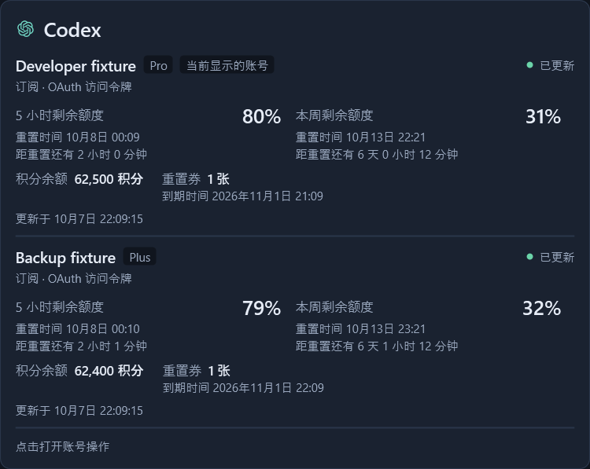
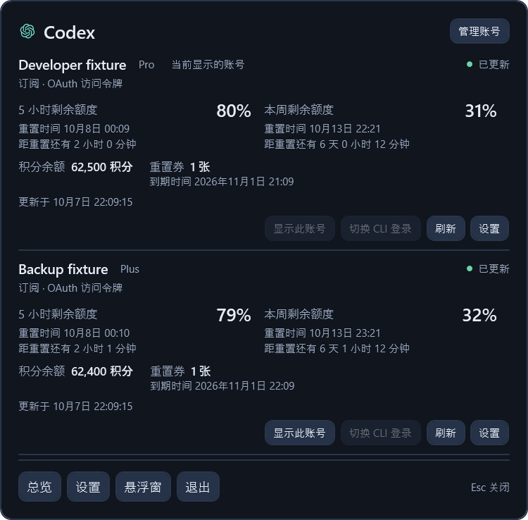

# GameDevUsageBar

**把 AI 剩余额度、积分和余额，放进一条安静的 Windows 用量栏。**

Windows 10/11 · x64 · v0.9.8 预览版 · 中文 / English

[English](README.md) · [下载](https://github.com/tabztggg/GameDevUsageBar/releases/tag/v0.9.8) · [安装说明](docs/installation.zh-CN.md) · [额度接口](QUOTA-API.zh-CN.md) · [Release 说明](docs/releases/v0.9.8.md)


查看 Claude、Codex 的订阅额度，Tripo、GRSAI 的 API 积分，以及其他服务的余额和本机网速。可使用右下角托盘、桌面单行悬浮栏或完整总览。

*截图来自实际 WPF 界面的模拟数据渲染，不包含真实用户账号，也不代表已验证所有服务的真实访问权限。*

## 下载和启动

在 [Releases](https://github.com/tabztggg/GameDevUsageBar/releases/tag/v0.9.8) 中选择：

| 文件 | 用途 |
| --- | --- |
| `GameDevUsageBar-0.9.8-win-x64-setup.exe` | 固定目录安装、开始菜单快捷方式，以及可选登录自启动 |
| `GameDevUsageBar-0.9.8-win-x64.zip` | 解压后运行的便携版 |
| `package-manifest.json` | 版本、源码提交、文件大小及哈希 |
| `SHA256SUMS.txt` | 核对下载文件完整性 |

**运行时已包含，启动程序无须另装 .NET 或开发工具。** 便携版需保留完整目录。原生 CLI 和浏览器功能需要对应软件；添加 Claude 账号还要求另外安装本机受保护的 Bridge。

启动后，在服务的**设置**中选择认证来源，配置、启用并保存。新来源默认禁用。升级、卸载和故障处理见[安装说明](docs/installation.zh-CN.md)。

## 悬浮栏和总览


- **单行悬浮栏：** 36 DIP 高度、小图标、剩余百分比、原生积分/货币单位和下载/上传 MB/s。
- **自定义两个重点模块：** 任意服务都可放入顶部大模块，其他服务以紧凑行显示，详情可展开。
- **明确重置周期：** 5 小时额度显示小时和分钟，较长周期显示天、小时、分钟；来源返回重置券时，同一行显示张数及过期日期。
- **悬停查看该服务的全部账号：** 栏上每个服务保留一个入口，详情分别显示各账号额度、重置、余额、重置券到期和状态；列表过长可滚动，点击后提供逐账号操作。
- **位置和透明度可调：** 拖动握柄、置顶、锁定位置，或调节底色透明度；文字和图标保持清晰。
- **中英文即时切换：** 不改动自定义账号名称。

百分比代表**剩余额度**。缺失信息不补成 0；实时、缓存、过旧、演示、鉴权、权限和限流状态分别显示。

### 悬停看详情，点击可操作

悬停某个服务，在一个紧凑面板里对比这个服务的全部账号。来源返回时，5 小时和周额度并列显示，余额和重置券到期放在下方；鼠标可移入面板滚动。点击后显示相同信息，并为每个账号提供**显示此账号**、支持时的**切换 CLI 登录**、**刷新**和**设置**。

| 悬停详情 | 点击后的服务商弹窗 |
| --- | --- |
|  |  |

## 支持的服务

| 服务 | 查询内容 | 认证方式 |
| --- | --- | --- |
| Claude | 接口返回的 5 小时、周、模型额度及额外用量 | 当前 CLI OAuth、保存的 CLI 登录、手填 OAuth，或 Firefox Cookie + 组织 UUID |
| Codex | 接口返回的配额周期、套餐、积分和重置券库存/到期 | 当前 CLI、保存的 CLI 登录，或手填订阅 OAuth |
| Tripo | 全球版/中国版 API 可用与冻结积分 | API Key |
| GRSAI | 全球/国内节点的账号剩余积分 | API Key |
| DeepSeek | 官方 API 余额，保留接口币种 | API Key |
| ElevenLabs | 字符额度、已用/剩余字符及重置时间 | API Key |
| OpenRouter | 已购积分减用量后的剩余美元余额 | 有积分查询权限的 API Key |
| Gemini CLI | Code Assist 返回的额度及重置时间 | 当前 CLI 登录或手填 OAuth |
| Gemini AI Studio | Google Cloud 项目近 24 小时完成的 Gemini API 请求数 | 项目 + 具有 Monitoring 读取权限的 Google OAuth |

查询适配已实现，但实际账号须具有相应接口权限。程序按返回字段显示，不根据 Pro/Plus 标签推断固定额度或周期。券库存仅在来源返回时显示；不能保证当前 Claude 接口能查到真实重置券。

Tripo API 积分不包含 Studio 积分。Gemini AI Studio 请求数**不是剩余额度或余额**，不能用 Gemini API Key 查询。OpenRouter 积分接口可能要求管理密钥。本版不包含 TypeSafe 或 VPS 流量查询。

## 多账号和快速切换

悬停栏上的某个服务，只显示**该服务保存的全部账号**。账号数量按实际数据决定，列表过长可滚动；点击后提供逐账号操作，也可从**管理账号**或**托盘菜单 → 账号 → 服务**进入。


**显示此账号**仅改变栏和总览。**当前显示的账号**标记代表展示选择，不代表 CLI 或已有桌面会话已切换。各启用账号的凭据、节点、查询状态和用量独立；增加账号会增加额度查询请求。

Codex 和已有的 Claude 登录快照，可在你自行登录各账号后，通过**保存当前 CLI 登录**保存 Windows 当前用户加密的认证副本。**切换 CLI 登录**是独立、明确的操作，只用于受支持的已保存登录：先关闭 CLI 会话；程序保存加密恢复数据，仅替换支持的 auth 文件/字段并核验。遵循 `CODEX_HOME` 和 `CLAUDE_CONFIG_DIR`，保留 Claude 文件中的其他字段，不替换已运行的桌面会话。忙碌、只读或结果未确定时明确提示，不自动重放认证写入。

在管理账号中，**添加 Claude 账号**要求显示名称，并创建独立配置目录，通过另外安装的本机受保护 Claude Code Bridge 打开手动订阅登录。每次授权使用全新的独立 Firefox 配置，不导入其他配置的 Cookie、历史、缓存、密码或会话。你完成授权且原生进程确认成功退出后，程序只绑定和刷新该槽位。改名不移动目录；已确认失败保留待登录账号供明确重试，结果未知则保持阻断。本版测试核验目录隔离和离线启动约定，不代表已完成真实账号登录验收。见[账号与认证](docs/installation.zh-CN.md#账号与认证)。

程序运行时，沿用原有续期管理器，对已启用、明确绑定的 Claude **本地 OAuth**账号在令牌到期前续期，遵守原生锁与每个账号的准确目录。账号快照和手填令牌不自动续期；凭据撤销或过期需要重新登录，未知结果不自动重放。独立 Claude 目录使用配置格式 5，要求 v0.9.6 或更新版本，不要修改格式以强行降级。

## 本机只读额度接口

其他本机工具可读取：

```powershell
Invoke-RestMethod -NoProxy -TimeoutSec 5 http://127.0.0.1:17864/v1/health
Invoke-RestMethod -NoProxy -TimeoutSec 5 http://127.0.0.1:17864/v1/usage
Invoke-RestMethod -NoProxy -TimeoutSec 5 http://127.0.0.1:17864/v1/accounts
```

还支持单服务、单账号以及网速接口。仅允许 GET，不返回凭据、不触发刷新、账号切换、令牌续期或付费调用。程序必须运行；接口仅绑定 IPv4 本机回环地址。

调用方须核对所需指标的时效及 `usable`；多个工具读到的余额不是各自独占的额度。详见[中文接口约定](QUOTA-API.zh-CN.md)和安装目录内的 `api/Get-GameDevQuota.ps1`。

## 本地数据与安全

从 v0.9.2 起，有容量上限的启动、退出、错误及资源日志保存在 `%LOCALAPPDATA%\GameDevBar\logs`。从总览或托盘菜单打开**导出诊断信息…**，预览后可将过滤后的 ZIP 保存到本机。中断的会话会在下次启动时标记，不推断缺乏证据的退出原因。见[诊断日志说明](docs/diagnostics.zh-CN.md)。

配置、缓存、加密凭据和显示设置位于 `%LOCALAPPDATA%\GameDevBar`，沿用旧目录名以保持兼容。安装或卸载不会退出 Codex、Claude 或 Gemini 登录。

无法读取的设置保留原文件并进入只读模式，不用默认值覆盖。修复或恢复原文件后再保存账号变更；已知账号设置只读时，CLI 切换也会在修改 auth 前拒绝操作。

额度查询不生成内容、不兑换重置券。明确发起的 Claude 手动登录、本地 OAuth 自动续期和 CLI 切换，是上文限定的认证写入操作。请求保留 TLS 校验、响应限制、禁用重定向和账号/来源缓存隔离；显示及语言切换不查询服务。

文件未签名。SHA256 核对完整性，不是杀毒认证；不要关闭安全软件安装。见[安装与卸载](docs/installation.zh-CN.md)。

## 构建与扩展

源码要求 `global.json` 固定的 **.NET SDK 10.0.401**；使用依赖锁文件，警告按错误处理。

```powershell
.\tools\build.ps1 -Publish -DotnetPath '<dotnet.exe 的路径>'
# 可选：在解锁的 Windows 桌面上运行隔离 WPF/Win32 检查
.\tools\build.ps1 -UiChecks -DotnetPath '<dotnet.exe 的路径>'
# 生成安装包、便携 ZIP 和校验值（需要 Inno Setup 6.3+ 或 7）
.\tools\package-release.ps1 -DotnetPath '<dotnet.exe 的路径>' -InnoCompiler '<ISCC.exe 的路径>'
```

Core 管理账号、指标和刷新；Providers 实现来源与解析；Infrastructure 管理受限请求、DPAPI、原生认证、网速和本地接口；App 提供 WPF 界面和托盘。新增服务须同步增加允许的请求/认证路径、解析测试与显示标签，不开放任意 URL 接收凭据。测试范围见 [ACCEPTANCE.md](ACCEPTANCE.md)，模拟通过不等于真实账号接口可用。

## 归属与许可

原创代码[由所有者保留权利](LICENSE.txt)，第三方许可单独保留，见 [THIRD-PARTY-NOTICES.md](THIRD-PARTY-NOTICES.md)。

部分服务图标源自 [CodexBar](https://github.com/steipete/CodexBar/tree/main/Sources/CodexBar/Resources)，保留 MIT 声明；参考或派生解析代码保留 [NOTICE-CodexBar.txt](NOTICE-CodexBar.txt)。产品名称和商标归各自所有者。
